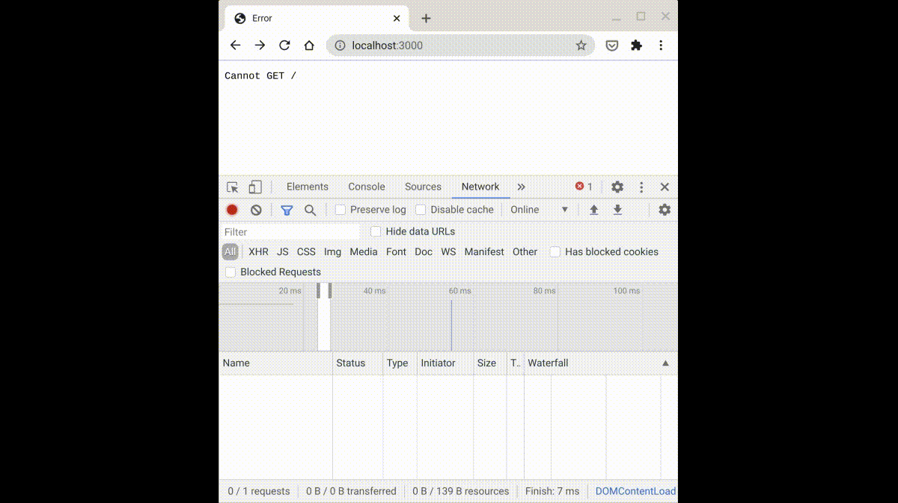

# Question 2 - AJAX and APIs

## Overview

__The files, `app.js`, `02-courses.js`, and `02-courses.html`__ contain a partially implemented express application. The file paths and commands mentioned below __assume that you are in the root of the final exam folder__.

In `app.js` and `02-courses.js`, implement a backend API and a frontend client that interacts with that API. The API will allow you to read course numbers, as well as retrieve detailed information about those courses (such as name and description).

### TL;DR:

1. Add routes to the existing application in `app.js` that allows retrieval of:
	* all course numbers
	* course detail info based on course number
2. On the client, in `public/02-courses.js`, make an initial AJAX request to load all course numbers
3. Every time a course number is clicked, make another AJAX request to load the course detail info associated with the course number
4. ⚠️ The markup and styles embedded in `public/02-courses.html` __do not__ have to be modified

## Setup

### Starter Data

Using your `mongo` client, start by inserting documents into the `courses` collection of a database called `fa20-ait`.

```
use fa20-ait
db.courses.insertMany([
  {number: '0480', 'name': 'ait', 'description': 'wAIT wats the web?'},
  {number: '0479', 'name': 'dma', 'description': 'data for my dataBae'},
  {number: '0003', 'name': 'icp', 'description': 'bits and bytes'},
  {number: '1337', 'name': 'applied meme construction', 'description': 'heckin'},
]);
```

A schema is already defined directly in `app.js`, and all mongoose setup code is present. Retrieving course numbers and their associated course names and descriptions can be done by using `Course`. If necessary, change the connection string in the call to `connect` to work with your local database, but change it back before uploading!

### App

* `npm install express mongoose`
* The application can be started with `node app.js`
* You can view the application at `http://localhost:3000/02-courses.html` and the API at `http://localhost:3000/api/courses`

## Part 1 - Add to the API

In `q2-app.js`, add two route handlers:

1. `http://localhost:3000/api/courses`
	* this route returns json containing the course numbers of all the courses in the database as a JSON `Array` of `String`s; for example:
		```
[
	"0480",
	"0479",
	"0003",
	"1337"
]
```
2.`http://localhost:3000/api/courses/0480` where the path component after `courses` represents the course number, such as `0480`
	* this route returns the detailed information about the course number supplied; for example:
		```
{
	_id: "5fd049954db82a925216e106",
	number: "0480",
	name: "ait",
	description: "wAIT wats the web?"
}
```

## Part 2 - Interact with the API

* In `public/q2-courses.js`, finish the client side code to interact with the API
* Some code is already written for you:
  * `getURL` is a helper function wrapping xmlhttprequest; you're welcome to use it... other options include: manually constructing your xhr, using `fetch`, or using `fetch` with `async` and `await`
  * a `main` function is present where most of your code will go, but you can add helper functions as needed
* As soon as the page loads, populate the navigation bar containing course numbers by retrieving the course numbers from `/api/courses` and adding them as children to the `nav` element within the markup 
  * You must make a request to `/api/courses` as part of your solution to displaying the initial page
* Every course number displayed in the horizontal navigation bar should be clickable
* When a course number is clicked, a request must be made to the route that you created for retrieving course detail info for a particular course
* The course details should be displayed underneath the navigation bar of course numbers within the `section` element
* Clicking on another course number will replace the existing (if any) course detail info


* Remember that you can access an element's attributes by dotting the element
* hooks into ids for columns
* you can add additional helper functions
* you can add more apis if you want, but first call must be to
* code present cannot be changed
* initial call must be used to populate left column


## Example Interaction



## Upload Your Solution

⚠️  __Remember to upload BOTH `app.js` (server side code) and `public/q2-courses.js` (client side code)__. Only these two files have to be uploaded (the html file does not need to be included); however, __do not change the names of the files!__
