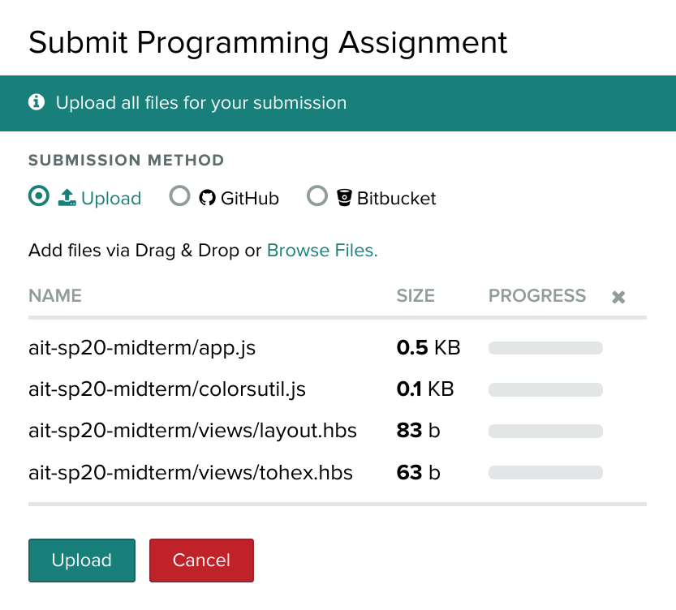
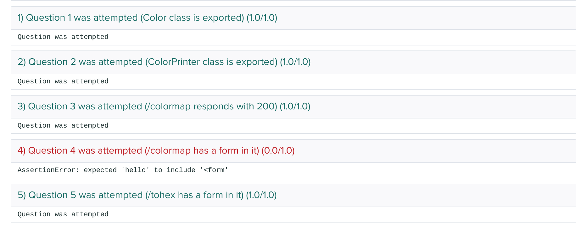

# Midterm Exam

Online research, class examples, and your work from previous homework assignments can all be used in your solutions for the questions below. However, ⚠️  __collaboration with other students is not allowed__ - similarities among solutions will be flagged. 

⚠️  Submission Process

1. [Download the starter files, ait-fa20-midterm.zip](ait-fa20-midterm.zip)
2. Write all of your code within the folder `ait-fa20-midterm`
3. Additional templates can be added
4. The only modules that can be used are the ones `require`d in `app.js` and `mymodule.js` ...and built-in modules in node (such as `fs`, `path`, `net`, etc.). No new modules can be installed, however.
	* the zip file will contain a package.json _outside_ of the project folder
	* `npm install` where package.json is located to retrieve dependencies
5. __MAKE SURE YOUR CODE IS RUNNABLE and THERE ARE NO IMMEDIATE RUNTIME ERRORS__ before your last submission!
6. __UNCOMMENT BOTH the export (at the bottom) as well as the class / variable / function definition to show that you've attempted a question__
	* for example, in your express app, export `app`
	* `module.exports = app.listen(3000);`
7. __DO NOT UPLOAD NODE_MODULES or temporary files__ for your last submission!
	* temporary files include your editor's working files (like `._app.js` or vim's `.app.js.swp`), `.DS_Store`, etc.
8. Finally, zip up the directory (make sure `ait-fa20-midterm` is at the top level) and upload to gradescope... when you upload it, take note of the files being sent (it should have `mymodule`, `app`, your templates / layouts, etc. 
9.  __Submit at least once several minutes before the end of the exam to ensure you've submitted your work  before time is up__ ... resubmissions are allowed


### ⚠️ Although there are tests and an "autograder", your submission will still be downloaded and tested manually
### ⚠️ Partial credit is given






Once submitted, the autograder will run to verify that your functions and routes are named correctly. Note, however, that passing tests from the autograder does not mean a correct solution was submitted. Conversely, a failing test does not mean that you won't get credit for the question, as your work will be manually tested as well. See image below to see the autograder output. Although one section is marked red to signify a failing test, it will still be reviewed manually. Again, passing these test only means you named things correctly.



<style>
img {
	height: 50%;
}
</style>

👀 __Note that it's likely that you may not be able to finish all of the questions__. This is 🆗, the exam grading will take into account that not all questions may have been attempted. 

* All questions will have an equal point value
* Technically, most questions do not have to be implemented in order
* In general, the questions are in order of _difficulty_ 

## 1. Academic Integrity Statement and Required Files are Present

Read and "sign" a pledge regarding academic integrity. This is marked as __required__.

To do this, 

1. __Uncomment the definition and export for the function, `pledge`__:
2. In the function, simply return the string below with the text starting and ending with square brackets replaced with your own full name.

```
I pledge that the work in this exam submission is my own. I did not receive any help in constructing my solutions. I understand that the following resources are allowed:

1. my own notes and homework solutions
2. online documentation for the technologies involved
3. online resources that are not directly related to the exam question (for example, an existing stackoverflow post to debug a runtime exception is allowed)

I also understand that using resources outside of those listed above (such as _actually_ asking a question on a Q&A forum, receiving help from another student, etc.) or sharing my own answers will be considered an academic integrity violation.

[Your Full Name Here]
```

Lastly, be sure not to rename or delete `mymodule.js` and `app.js`.

## 2. HTTP (10 points)


### a - Status Code

What is the response status code that an http client receives if it makes a request to [https://cs.nyu.edu/~jversoza/csci-ua.480-fa2020-a.php](https://cs.nyu.edu/~jversoza/csci-ua.480-fa2020-a.php) __with a query string added as__ `netid=YOUR_NETID`? Answer by returning the status code value as a `Number` in the function, `a`, in `mymodule.js`. Uncomment both the function and the export.

### b - Status Code

What is the response status code that an http client receives if it makes a request to [https://cs.nyu.edu/~jversoza/csci-ua.480-fa2020-b.php](https://cs.nyu.edu/~jversoza/csci-ua.480-fa2020-b.php) __with a query string added as__ `netid=YOUR_NETID`? Answer by returning the status code value as a `Number` in the function, `b`, in `mymodule.js`. Uncomment both the function and the export.

### c - HTTP Request

You are on a page with a single link. The markup for the link looks like this:

`<a href="http://foo.bar.baz/qux.html">Click this link!</a>`

Clicking on the link causes your browser to make an HTTP request. Assuming there are no browser plugins or frontend JavaScript that modifies link behavior, determine the first line of the HTTP request generated when the links is clicked. In the function `c`, in `mymodules.js`, return the first line of this HTTP request as a string. For example `return "YOUR ANSWER HERE";`. OK to assume HTTP/1.1. Uncomment both the function and the report.

### d - HTTP Request

You are on a page with a from. The markup for the form looks like this:

```
<form method="GET" action="pizza">
<input type="text" name="topping">
<input type="submit">
</form>
```

Filling out the single form element with the value "pineapple" and then clicking the submit button causes your browser to make an HTTP request. Assuming there are no browser plugins or frontend JavaScript that modifies form submission behavior, determine the first line of the HTTP request generated when the the submit button is clicked. In the function `d` in `mymodule.js`, return the first line of this HTTP request as a string. For example `return "YOUR ANSWER HERE";`. OK to assume HTTP/1.1.  Uncomment both the function and the report.


## 3. `net` Module (10 points)

The code below is a partial implementation of a tcp/ip server that stores key and value pairs. If a client sends JSON with a single property, `k`, the server will use `k`'s value to look up a value from the server's in-memory storage to send back to the client. If the server received json with both a `k` and `v` property, the server uses the values of `k` and `v` to add a new key and value pair to the storage. Here's how it might work (all of the json is sent to the server, while the lines prefixed with `val:` are sent back from the server):

```
$ nc localhost 3000
{"k":123}
val: somedata
{"k":456, "v": "foo"}
{"k":456}
val: foo
```

Fill in the blank lines in the code below to implement this server. The lines of code available to use are number and listed below. To "answer" the question, in function `e` in `mymodule.js`, return an `Array` with the blanks corresponding to indexes, and the array elements corresponding to the number of the line of code you'd like to fill in the blank with. Remember to uncomment both your implementation and the export at the end of the file. For example: `return [7, 4, 1, 5, 12]` fills in blank 0 with line 7, blank 1 with line 4, etc. ...

```
const net = require('net');
const storage = {'123': 'somedata'};

// 0 
  // 1  
  if(v === undefined) {
    // 2
  } else {
    // 3 
  }
};

const onConnect = sock => {
  // 4
};

const server = net.createServer(onConnect);
server.listen(3000);
```


1. const {k, v} = JSON.parse((data + ''));
2. const {k, v} = data;
3. const k = data["k"];
4. const v = data["v"];
5. sock.on('data', onData);
6. sock.on('data', sock => onData(sock, data));
7. sock.on('data', data => onData(sock, data));
8. storage[k] = v;
9. storage = data;
10. storage["k"] = v;
11. storage[123] = v;
12. sock.write("val: somedata\n");
13. sock.write(\`val: ${storage[k]}\n\`);
14. sock.write(\`val: ${storage[123]}\n\`);
15. const onData = (data) => {
16. const onData = (sock) => {
17. const onData = (sock, data) => {

## 4. Reduce (10 points)

In the program below, use reduce to print out all of the words in the `Array`, `animals`, that start with a vowel, as all uppercase (essentially mimicking filter and map without _actually_ using filter and map): `[ 'ANT', 'ELK', 'IBEK' ]`

* The string method `indexOf` finds the index of the string passed in as the argument (the _substring_) in the original string that `indexOf` was called on. It returns `-1` if the _substring_ is not found.
* Characters in JavaScript strings can be accessed by position by indexing: `someVar[0]`
* The string method `toUpperCase()` returns a new string composed of the original string's characters all converted to uppercase

Fill in the blank lines in the code below to implement this program. To "answer" the question, in function `f` in `mymodule.js`, return an `Array` with the blanks corresponding to indexes, and the array elements being the missing code. Remember to uncomment both your implementation and the export. For example: `return ["const a = 0", "parseInt", "a", "b[2]", "a + 1"]` fills in blank 0 with `const a = 0`, blank 1 with `parseInt`, etc. ...

Note the format: spaces between operators and operands, and no spaces when indexing.

```
const animals = ['ant', 'cat', 'bat', 'dog', 'elk', 'frog', 'hen', 'ibek'];
const res  = animals.reduce((acc,  ___0___) => {
  if('aeiou'.indexOf(___1___) > -1) {
    ___2___(ele.toUpperCase());
  }
  ___3___;
},  ___4___);
console.log(res);
```

## 5. Classes (10 points)

Given the following class, answer the questions below:

```
class Foo {
  constructor() {
    this.bar = 'baz'; 
  }
  qux() {
  }
}
```

* __0__ - what is the prototype of an instance of `Foo`? Answer with a string, such as `"Object.prototype"`
* __1__ - does an instance of `Foo` have an "own" property (that is, defined on the instance rather than in the prototype chain) called `bar`? Answer with the string "yes" or "no".
* __2__ - does an instance of `Foo` have an "own" property (that is, defined on the instance rather than in the prototype chain) called `qux`? Answer with the string "yes" or "no".
* __3__ -  what is the prototype of `Foo`? Answer with a string such as `"Object.prototype"`

To answer this question, give back an `Array` in function `g` (in `mymodule.js`) that contains the answers based on index. Remember to uncomment both your impelmentation and exports. For example `return ["Foo", "bar, "Baz", "QUX"]` answers question 0 with Foo.

## 6. Higher Order Functions (20 points)

### `all`

In `mymodule.js`, implement a function called `all`. Remember to uncomment both your implementation and export. `all` will determine if every element in an `Array` passes a test / gives back true for a test (or, alternatively, if every element in an `Array` fails / gives back false for a test).

It should have three parameters:

1. arr - an `Array` to operate on
2. result - a boolean that represents the desired outcome of the test function (true or false)
3. test - a function to test every element in the array

`all` will return `true` if calling `test` on every element in `arr` returns the boolean specified by `result`

Example:

```
all([2, 4, 6, 8], true, n => n % 2 === 0); 
// true (every element causes test to give back true)

all([2, 4, 5, 8], true, n => n % 2 === 0); 
// false (not all elements cause test to give back true)

all([1, 3, 5, 7], false, n => n % 2 === 0); 
// true (every element causes test to give back false)
```

### `makeKeyAgg`

In `mymodule.js`, implement a function called `makeKeyAgg`. Remember to uncomment your implementation and the corresponding exports. `makeKeyAgg` modifies an aggregate function (a function that performs calculations based on every element in an `Array`, such as average, max, min, etc.) so that it works on values for a specific key for every object in a JSON Array.

`makeKeyAgg` has one parameter: the function to "modify".

The function that `makeKeyAgg` returns has three parameters:

1. a filename for a JSON file to open
2. the key to look for in each object in the `Array` of objects in JSON
3. a callback function to call once the JSON file has been processed

For example, if given the function "max", `makeKeyAgg` will return a new version of max that accepts a file name, key and callback as arguments. It will perform max on the collection of values that are contained in key, `k` in an `Array` of objects.

Imagine a JSON file, `data.json`,  containing:

```
// data.json
[{"x":1, "y":4}, {"x": 9, "y":3}]
```

Assume that a function called `avg` exists that takes an `Array` and calculates the average value of the elements in the `Array`. Using `makeKeyAgg` on `avg`, we get a new function that can be used like this:

```
const f = makeKeyAgg(avg);
f('data.json', 'x', console.log); // open data.json, and aggregate on key, "x"
// would print out 5 
```

Another example (using the file `test.json` as the sample file):

```
// test.json contains:
//[
//		{"a": 10, "b":2, "c":1},
//		{"a": 5, "b":3, "c":2},
//		{"a": 4, "b":-1, "c":7},
//		{"a": 7, "b":0, "c":9}
//]
const sumKey = mymodule.makeKeyAgg(col => col.reduce((total, num) => total + num));
sumKey('test.json', 'b', val => { 
	console.log(val);
});
// result is 4, as key b is summed
```


## 7. Express Basics / Adding and Displaying Data (20 points)

In `app.js`, respond to the path `/math` with a page that allows you to:

* enter 3 values: 2 numbers and an operation (`+`, `-`, `*`) into a form... the __names of these fields  must be__: `a` (the first operand), `b` (the second operand) and `op` (an operator)
* you can use any kind of form `input` for these
* however, use the appropriate `form` attributes based on the remainder of the requirements (for some attributes, the value for an attribute of the `form` element is your discretion)
* when the form is submitted, all of the data should be saved on the server (use the appropriate http method for this)!
* refreshing the page should not cause the form to be resubmitted
* when submitting the form, the path of the HTTP request should also be `/math`
* if any of the values were not valid (for example the first two values are not numbers or the last value is not one of `+`, `-`, `*`), do not save data, and instead, display an error message above the form, with the exact text: `Validation error`
* any data submitted (from the current submission or any previous submissions) should be displayed on the page as part of unordered list
	* additionally, the result of applying the operation `+`, `-`, `*` should be shown in the same list item as well: 
	* you can use the following format: `a op c = result` where a is the first operand, op is the operation, c is the second operand, and result is the result of the calculation
* all clients can see all data submitted historically
* if the server is restarted, it is ok if the data is reset

Examples below

<style>
input[type="text"],  input[type="number"] {
	width: 3em;
}

.example {
	border: 1px solid black;
	display: inline-block;
	padding: 1em;
}
</style>

### A filled form and some data from a previous submission:

<div markdown="block" class="example">
<form>
num1: <input type="number" value="4" maxlength="3"> num2: <input type="number" value="3" maxlength="3"> op: <input type="text" value="*" maxlength="2"> <input type="submit">
</form>

* 1 + 2 = 3
</div>


### Submitting the form with values above should result in:

<div markdown="block" class="example">
<form>
num1: <input type="number" value="" maxlength="3"> num2: <input type="number" value="" maxlength="3"> op: <input type="text" maxlength=""> <input type="submit">
</form>

* 1 + 2 = 3
* 4 * 3 = 12
</div>


### Submitting the form with an error should result in (again, assuming previous valid submissions - make sure to use exact text as below):

<div markdown="block" class="example">
Validation error

<form>
num1: <input type="number" value="" maxlength="3"> num2: <input type="number" value="" maxlength="3"> op: <input type="text" maxlength=""> <input type="submit">
</form>

* 1 + 2 = 3
* 4 * 3 = 12
</div>	

## 8. More Express / File IO (20 points)

Write middleware that checks for the presence of any of the foods listed in files `food1.txt` and `food2.txt` in the value part of any name value pair in the query string. If one of the foods are found in the query string value, send back an HTTP status with response code `451` and page content, `banned`.

If the values in the query string do not match any of those in the files, continue processing the request as your app normally would. For example, using the path from the previous question, `/math`... `/math?foo=broccoli` (broccoli is contained in `food1.txt`) would give back a `451`. However, `/math?food=candy`, would result in the regular version of `/math` appearing. This logic should work for any path!

Examples (with the following words compiled from both sample files, `food1.txt` and `food2.txt`):

```
broccoli
eggplant
mango
rambutan
```

* `GET /foo?bar=rambutan` results in a 451, and page content, "banned"
* `GET /foo?qux=pizza` results in a 200 if /foo exists in route handlers
