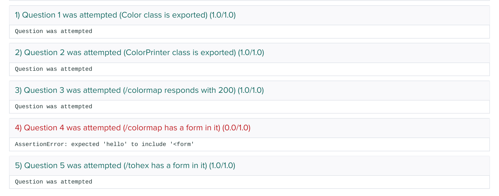

# Example Questions for Midterm

The instructions and questions below will be very similar to the actual exam... with the exception of an academic pledge being required as one of the first questions.

<hr>

Online research, class examples, and your work from previous homework assignments can all be used in your solutions for the questions below. However, ⚠️  __collaboration with other students is not allowed__ - similarities among solutions will be flagged. 


⚠️  Submission Process

1. [Download the starter files, ait-sp20-midterm-sample.zip](ait-sp20-midterm-sample.zip)
2. Write all of your code within the folder extracted (called `ait-sp20-midterm`)
3. The dependencies of the project are in `package.json`, which will be outside of `ait-sp20-midterm`:
	* note that it is __outside__ of the midterm project directory	
	* your can run `npm install` where `package.json` is, and it will create `node_modules` outside of the midterm project directory
	* when you zip your project for submission, DO NOT INCLUDE `node_modules`
	* (there should be no need to remove it, though)
4. Additional templates can be added
5. The only modules that can be used are the ones `require`d in `app.js` and built-in modules in node (such as `fs`, `path`, `net`, etc.)
6. __MAKE SURE YOUR CODE IS RUNNABLE and THERE ARE NO IMMEDIATE RUNTIME ERRORS__ before your last submission!
7. __Export the classes or variables as specified in each question__
	* for example, in your express app, export `app`
	* `module.exports = app.listen(3000);`
8. __DO NOT UPLOAD NODE_MODULES or temporary files__ for your last submission!
	* the autograder should warn you about this
	* temporary files include your editor's working files (like `._app.js` or vim's `.app.js.swp`), `.DS_Store`, etc.
9. Finally, zip up the directory (make sure `ait-sp20-midterm` is at the top level) to gradescope (see image below - files uploaded are all within directory `ait-sp20-midterm`)
10.  __Submit at least once several minutes before the end of the exam to ensure names of functions and routes are correct__ ... resubmissions are allowed


Once submitted, the autograder will run to verify that your functions and routes are named correctly. (If you have accommodations, you can request local test files to continue working on code after the end of class). 

Note, however, that passing tests from the autograder __does not mean a correct solution was submitted (though they do partial correctness)__. Conversely, a failing test does not mean that you won't get credit for the question, as your work will be manually tested as well. See image below to see the autograder output. Although one section is marked red to signify a failing test, it will still be reviewed manually. Again, passing these test only means you named things correctly.


<style>
img {
	height: 50%;
}
</style>

👀 __Note that it's likely that you may not be able to finish all of the questions__. This is 🆗, the exam grading will take into account that not all questions may have been attempted. 

* All questions will have an equal point value
* Most questions do not have to be implemented in order
* ...However, questions marked with `REQUIRED` must be done because they are used as a foundation for questions after it
* Some questions may be dependent on or be easier to finish if the previous question were implemented
* In general, the questions are in order of _difficulty_ (with the exception of the last question on style)


## 1. Classes 

In `colorsutil.js`, create a class, `Color`, that represents a color. Colors can be represent as three components: red, green and blue... with each containing a value from 0 through 255. These three components are sometimes displayed as a series of hexadecimal digits in the format: `#RRGGBB` where the first two characters represent red, the next two characters are green, and the last two are blue (for example #FF0000 is red, with FF being 255 in decimal... remember in hex, 10-15 are represented by A-F). Usage of the class is as follows:

```
const c = new Color(255, 9, 170);

// property showing all components as Array
c.components // [255, 9, 170]

// methods returning the value of r, g, b components
c.r() // 255
c.g() // 9
c.b() // 170

// property showing the hexadecimal version of the color
c.hex // #FF09AA

// hint: calling toString(16) on a number converts it to a string representing 
// the hex version of the number

// (how far away is each original component from 255?)
c.invertedComponents() // [0, 246, 85] 
```
To convert a `Number` to a hex string, call the method, [`toString(16)`](https://developer.mozilla.org/en-US/docs/Web/JavaScript/Reference/Global_Objects/Number/toString#Description)

⚠️  __export your class with module.exports__


## 2. Fix the Error

Add the code below to your `colors.js`. Running the code below results in a runtime error. Fix the error so that the output is:

```
colors.csv red #FF0000
colors.csv yellow #FFFF00
colors.csv cyan #0000FF
```

```
class ColorPrinter {
  constructor(sourceFile, colors) {
    this.sourceFile = sourceFile 
    this.colors = colors
  }

  showColors() {
    this.colors.forEach(this.printColor);
  }

  printColor(colorObj) {
    console.log(this.sourceFile, colorObj.name, colorObj.hex);
  }
} 

const colors = [{name: "red", hex: "#FF0000'}, {name: "yellow", hex: "#FFFF00'}, {name: "cyan", hex: "#0000FF'}];
const cp = new ColorPrinter('colors.csv', colors);
cp.showColors();
```

⚠️  __export your class with module.exports__

## 3. `REQUIRED by 4, 5, and 6`  Create an Express App That Displays Data from a File

Given a file, `colors.csv`, that contains the mapping of a name of a color to its value in hex.... (you'll have to create this yourself in the root directory of your project)

```
Black,#000000
Navy,#000080
DarkBlue,#00008B
Teal,#008080
```

In `app.js` create an express app that has a route handler that responds to `/colormap`:

* the response should be an html page
* it should display the name and hex code of every color in `colors.csv` as an html table (`table`)
* each row (`tr`) consists of a mapping, with the left cell (`td`) containing the name and the right cell containing the hex code
* assume that `colors.csv` will not change 
* <strike>minimize the number of times the file `colors.csv` is read</strike>
* ensure that `colors.csv` is read <strike>prior to the start of the server</strike> any time before the response is sent (note that the way the autograder tests are currently structured, there is no way to _delay_ module.exports of app.listen)

At the end, get the result of your call to `app.listen` and export it 

`module.exports = app.listen(3000);`

## 4. Filtering

Add a form to the top of `/colormap` that contains a single text field  and a submit button

* the form should use the appropriate http method for filtering data
* submitting the form should result in the color mappings of the page being filtered by name 
* submitting the form should result in the path shown in the url bar as still being `/colormap`
* submitting the form should result in `?search=valueInTextField` being appended to the url
* all colors that contain the submitted text (ignoring case!) should be shown on the page
	* [`includes`](https://developer.mozilla.org/en-US/docs/Web/JavaScript/Reference/Global_Objects/String/includes) may be helpful
	* to normalize, try [`toLowerCase`](https://developer.mozilla.org/en-US/docs/Web/JavaScript/Reference/Global_Objects/String/toLowerCase)

## 5. `REQUIRED by 6` Numbers to Hex

Add a route handler to your express app that responds to `/tohex`

* it should serve an html form with three numeric fields representing red, green, and blue... and a button
* submitting the form should result in the url being `/tohex?r=123&g=123&b=123` where `123` is the value entered in the form
* after submitting the form, the page should display, above the form
	* the numbers submitted for red green and blue in a single `h1` tag
	* the hex value (in uppercase) associated with the color in another `h1` tag
	* the name associated with the color in the last `h1` tag
	* for example, submitting 255, 0, and 0 in the form fields (`/tohex?r=255&g=0&b=0`) should result in the following tags
		1. `<h1>Red:255, Green:0, Blue: 0</h1>`
		2. `<h1>#FF0000</h1>`
		3. `<h1>Red</h1>`
* no validation is required
* if a hex code is not found, then the name can be blank
* to convert a `Number` to a hex string, call the method, [`toString(16)`](https://developer.mozilla.org/en-US/docs/Web/JavaScript/Reference/Global_Objects/Number/toString#Description)


## 6. History

Underneath the form in `/tohex`, show all of the previously submitted numbers that the client has submitted. 

* show this as an unordered list (`ul` and `li`), with each list item (`li`) containing the numbers separated by space:
	* `<li>123 234 0</li>`
* using a different browser, using incognito mode or clearing cookies will result in no history of numbers being shown (or in other cases, a _different_ history of numbers)
* this history should not be modifiable on the client side (though the mechanism used to do this can be tampered with in such a way that previous data cannot be accessed)


## 7. Style 

* declare variables so that they are all block-level scoped
* make sure there are no unused variable names
* include the file that specifies what modules you've installed

